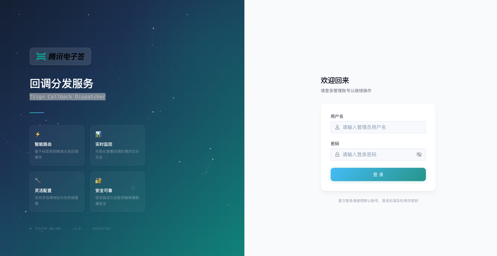
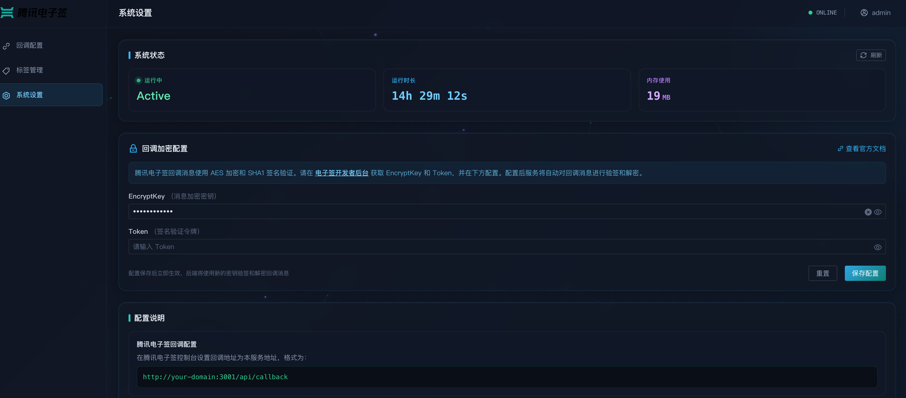
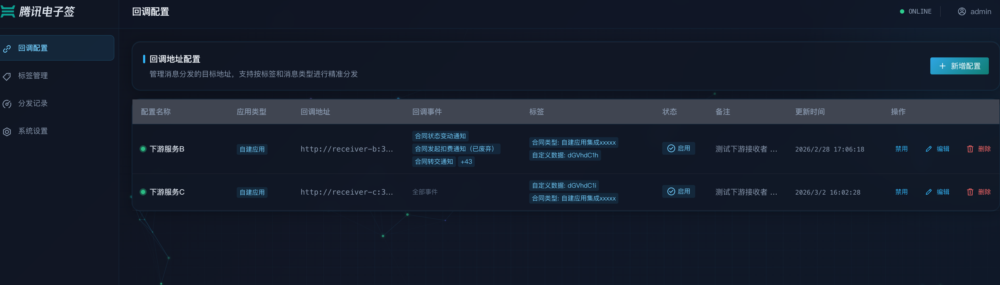
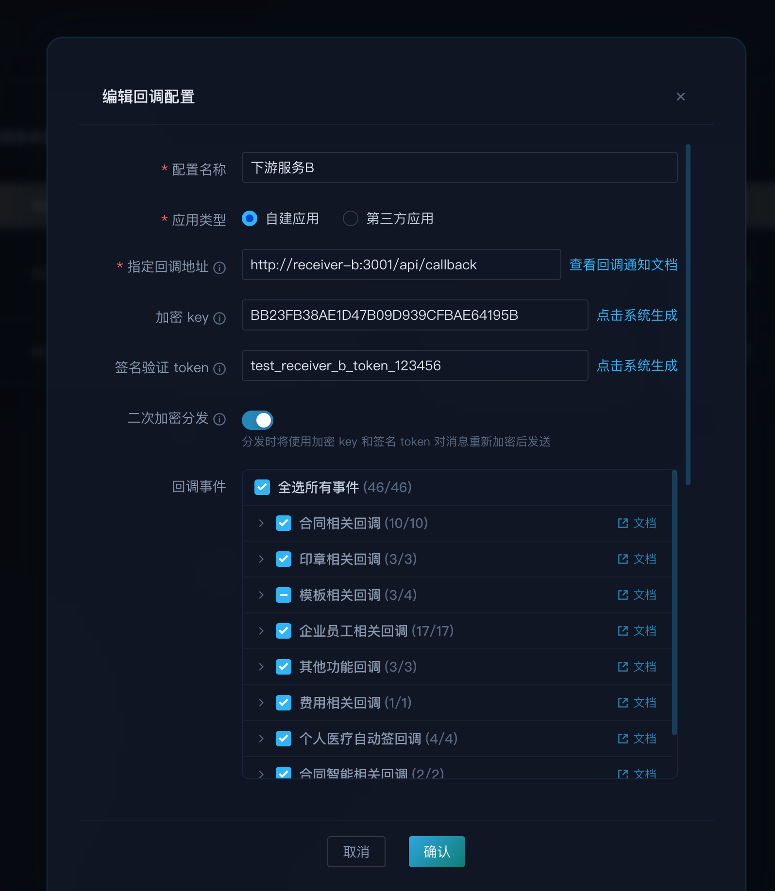
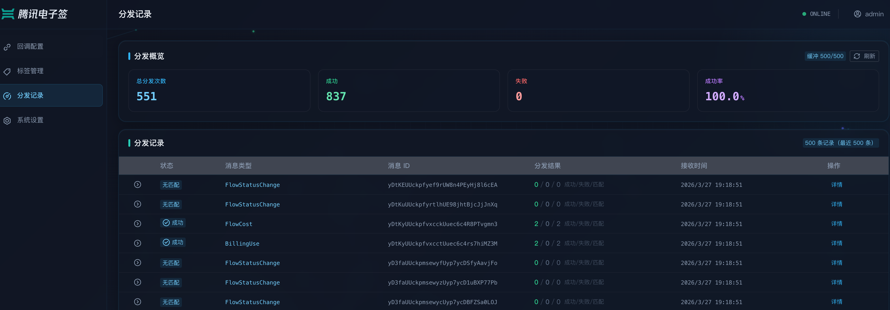
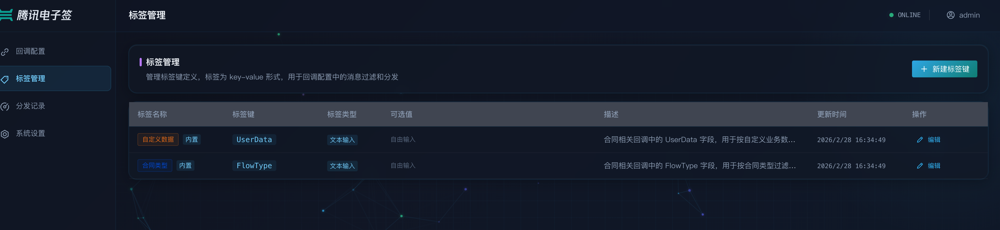

# 回调消息分发

## 目录

- [概述](#概述)
- [适用场景](#适用场景)
- [核心功能](#核心功能)
  - [一对多分发](#一对多分发)
  - [事件类型过滤](#事件类型过滤)
  - [标签匹配](#标签匹配)
  - [二次加密转发](#二次加密转发)
  - [自动重试](#自动重试)
  - [配置版本管理](#配置版本管理)
- [快速开始](#快速开始)
  - [前置条件](#前置条件)
  - [步骤一：部署服务](#步骤一部署服务)
  - [步骤二：配置腾讯电子签](#步骤二配置腾讯电子签)
  - [步骤三：登录管理面板](#步骤三登录管理面板)
  - [步骤四：配置电子签密钥](#步骤四配置电子签密钥)
  - [步骤五：添加下游回调配置](#步骤五添加下游回调配置)
  - [步骤六：验证](#步骤六验证)
- [功能说明](#功能说明)
  - [回调配置管理](#回调配置管理)
  - [标签管理](#标签管理)
  - [分发记录](#分发记录)
  - [系统设置](#系统设置)
- [工作流程](#工作流程)
- [部署方式](#部署方式)
- [常见问题](#常见问题)

---

## 概述

当企业对接腾讯电子签时，平台仅支持配置 **一个回调地址**。但在实际业务中，多个系统（CRM、ERP、OA、审计等）往往都需要接收回调消息。

**回调分发服务**（TSign Callback Dispatcher）解决了这个问题——它作为统一的回调接收入口，将腾讯电子签的回调消息按规则分发到多个下游业务系统。

```
                              ┌─→ CRM 系统（仅合同状态变更）
                              │
腾讯电子签 ──回调──→ 分发服务 ──┼─→ OA 系统（仅印章审批事件）
                              │
                              └─→ 审计系统（全量回调 + 加密传输）
```

## 适用场景

- 多个业务系统需要接收同一个腾讯电子签应用的回调消息
- 不同系统只关心特定类型的回调事件，需要按类型过滤
- 需要根据合同中的自定义数据（如 `UserData`、`FlowType`）将回调路由到不同系统
- 下游系统要求加密传输，需要对回调消息进行二次加密转发

## 核心功能

### 一对多分发

将腾讯电子签的一个回调地址拆分为多个下游目标，每个目标独立配置、独立启停。

### 事件类型过滤

支持按消息类型精确过滤，可按需选择合同、印章、模板、企业员工等类别：

| 分类 | 事件示例 |
|------|---------|
| 合同 | 合同状态变更、合同费用、合同转发、合同审批等 |
| 印章 | 印章操作、员工印章授权、用印记录 |
| 模板 | 模板新增、更新、删除、生效 |
| 企业员工 | 员工认证、角色变更、入职离职 |

> 不选择任何事件类型时，默认接收全部类型的回调消息。

### 标签匹配

标签系统允许根据回调消息体中的字段值进行更细粒度的过滤。

**内置标签：**

| 标签 | 消息字段 | 用途 |
|------|---------|------|
| UserData | `MsgData.UserData` | 按合同的自定义数据分发（常用于携带业务单号）。**注意：** 电子签平台要求 UserData 为 Base64 编码格式，匹配时比对的是 Base64 编码后的字符串 |
| FlowType | `MsgData.FlowType` | 按合同类型分发 |

**自定义标签：** 支持创建自定义标签并配置匹配规则，可基于消息中的任意字段路径进行匹配。匹配方式支持精确匹配、包含、正则表达式、枚举和字段存在性判断。

**示例：** 在 CRM 系统的回调配置中设置标签 `UserData = Y3JtX29yZGVy`（即 `crm_order` 的 Base64 编码），则只有发起合同时传入 `UserData` 为 `Y3JtX29yZGVy` 的回调才会分发到 CRM 系统。

### 二次加密转发

系统解密腾讯电子签的回调消息后，可为每个下游目标独立配置加密密钥，使用 AES-256-CBC 重新加密后转发。下游系统使用各自的密钥解密即可，实现端到端的安全传输。

### 自动重试

转发失败时自动重试（可配置次数和超时时间），提高投递可靠性。

### 配置版本管理

所有配置变更自动保存版本历史，支持一键回滚到任意历史版本。

---

## 快速开始

### 前置条件

- 已完成[腾讯电子签企业账号](https://qian.tencent.com/)注册和开发者配置
- 准备好服务器或 Kubernetes 集群用于部署

### 步骤一：部署服务

**Docker Compose 方式（推荐）：**

```bash
# 克隆项目并进入目录
git clone https://github.com/tencentess/tsign-callback-dispatcher.git && cd tsign-callback-dispatcher

# 配置安全凭据
cat > docker/.env << 'EOF'
JWT_SECRET=your-strong-random-jwt-secret-at-least-32-chars
ADMIN_DEFAULT_PASSWORD=your-strong-admin-password
EOF

# 启动服务
cd docker && docker compose up -d --build
```

> 也支持 Kubernetes 部署，详见项目 `k8s/` 目录的部署清单。

### 步骤二：配置腾讯电子签

登录 [腾讯电子签开放平台](https://qian.tencent.com/)，在应用的回调配置中：

1. 将 **回调地址** 设为：`https://your-domain/api/callback`
2. 记录应用的 **消息加密密钥**（encryptKey）和 **签名验证令牌**（token）

### 步骤三：登录管理面板

访问 `https://your-domain`，使用部署时设置的管理员账号密码登录。



### 步骤四：配置电子签密钥

进入 **系统设置** 页面，填入腾讯电子签应用的消息加密密钥和签名验证令牌，点击保存。



> ⚠️ 密钥必须与腾讯电子签开放平台的配置一致，否则回调消息将解密失败。

### 步骤五：添加下游回调配置

进入 **回调配置管理** 页面，点击「新建回调」，填写下游系统信息：



**配置项说明：**

| 配置项 | 必填 | 说明 |
|--------|------|------|
| 配置名称 | 是 | 便于识别的名称，如"CRM 系统-合同回调" |
| 目标 URL | 是 | 下游系统的回调接收地址 |
| 应用类型 | 是 | 自建应用 / 第三方应用（决定可选的事件类型） |
| 事件类型 | 否 | 勾选需要接收的事件类型，不选则接收全部 |
| 标签筛选 | 否 | 按消息字段值过滤，如 `UserData = crm_order` |
| 重试次数 | 否 | 转发失败时的重试次数，默认 3 次 |
| 超时时间 | 否 | 等待下游响应的超时时间，默认 10 秒 |
| 二次加密 | 否 | 开启后可自动生成或手动填入加密密钥 |
| 自定义请求头 | 否 | 为下游请求添加额外 HTTP Header |



配置保存后 **立即生效**，下一条回调消息即按新规则分发。

### 步骤六：验证

在腾讯电子签后台触发一次测试回调，或等待真实业务产生回调，然后在 **分发记录** 页面查看分发结果。



---

## 功能说明

### 回调配置管理

管理所有下游分发目标。每个配置可独立设置事件类型过滤、标签筛选、重试策略和加密方式，支持随时启用/禁用。

### 标签管理

管理标签定义和匹配规则。系统内置 `UserData` 和 `FlowType` 两个常用标签，也支持创建自定义标签，指定任意消息字段路径和匹配方式。



**匹配方式：**

| 方式 | 说明 | 示例 |
|------|------|------|
| 精确匹配 | 字段值完全等于指定值 | `MsgType` = `FlowStatusChange` |
| 包含 | 字段值包含指定子串 | `MsgData.FlowName` 包含 `采购` |
| 正则表达式 | 字段值匹配正则模式 | `MsgData.UserData` 匹配 `^order_\d+$` |
| 枚举 | 字段值在指定列表中 | `MsgType` 在 `[FlowStatusChange, FlowCost]` 中 |
| 存在判断 | 字段存在且非空 | `MsgData.FlowGroupMessage` 存在 |

### 分发记录

实时查看每条回调消息的分发结果，包括：

- **概览统计** — 总分发次数、成功数、失败数、成功率
- **详细记录** — 每条消息分发到各下游目标的状态、HTTP 响应码、耗时、重试次数
- **失败汇总** — 近期失败记录集中展示，便于快速排查
- **未分发详情** — 当消息未匹配到任何下游目标时，展示未分发的原因和消息详情，便于排查配置问题


### 系统设置

- **电子签密钥配置** — 配置和更新腾讯电子签的加密密钥与签名令牌
- **操作日志** — 所有配置变更的审计记录
- **版本管理** — 配置历史版本查看和一键回滚

---

## 工作流程

```
┌──────────────┐   加密回调     ┌─────────────────────────────┐
│  腾讯电子签   │ ────────────→  │        分发服务              │
└──────────────┘                │                             │
                                │  1. 验证签名（如已配置）      │
                                │  2. 解密消息                 │
                                │  3. 立即返回成功响应          │
                                │  4. 异步匹配规则并分发        │
                                └──────────┬──────────────────┘
                                           │
                           ┌───────────────┼───────────────┐
                           ↓               ↓               ↓
                      ┌─────────┐    ┌─────────┐    ┌─────────┐
                      │ 目标 A  │    │ 目标 B  │    │ 目标 C  │
                      │ 明文转发 │    │ 标签过滤 │    │ 加密转发 │
                      └─────────┘    └─────────┘    └─────────┘
```

**匹配逻辑：** 对于每个已启用的下游目标，系统依次检查——

1. **事件类型** — 消息的 `MsgType` 是否在目标配置的事件列表中
2. **内置标签** — 消息对应字段的值是否与配置的标签值匹配
3. **自定义标签** — 通过匹配规则动态计算的标签是否满足

全部条件通过后，消息才会被转发到该目标。

---

## 部署方式

| 方式 | 适用场景 | 说明 |
|------|---------|------|
| Docker Compose | 大多数场景 | 一键部署，开箱即用 |
| Kubernetes | 生产环境 | 多副本、自动扩缩容、RBAC、TLS |
| 本地开发 | 二次开发 | 前后端分离启动，支持热重载 |

详细部署步骤请参考项目 README 文档。

---

## 常见问题

### 下游系统没有收到回调？

1. 确认回调配置处于 **启用** 状态
2. 确认 **目标 URL** 可访问
3. 检查 **事件类型** 是否包含目标消息类型
4. 检查 **标签筛选** 条件是否过严
5. 在「分发记录」页面查看具体的失败原因

### 修改配置后多久生效？

**立即生效。** 保存配置后，下一条收到的回调消息即按新规则分发。

### 二次加密如何使用？

1. 在回调配置中开启「二次加密」
2. 点击「自动生成密钥」或手动填入密钥
3. 将密钥安全提供给下游系统用于解密
4. 转发的消息体将使用 AES-256-CBC 加密，附带签名参数

### 支持腾讯电子签的自建应用和第三方应用吗？

两种应用类型均支持。创建回调配置时选择对应的应用类型，系统会展示该类型下可用的事件列表。

