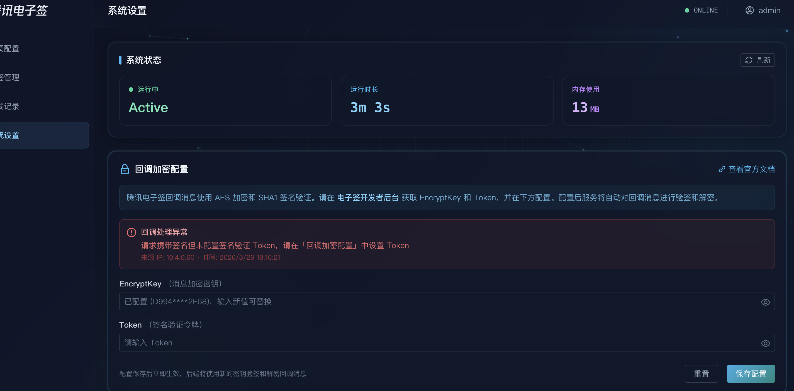

# 腾讯电子签回调分发系统 — 用户使用指南

> 本文档面向已完成系统部署的用户，帮助您了解如何登录、配置回调分发规则、管理标签以及调整系统参数。

---

## 目录

- [1. 系统简介](#1-系统简介)
- [2. 登录系统](#2-登录系统)
- [3. 回调配置管理](#3-回调配置管理)
  - [3.1 查看回调列表](#31-查看回调列表)
  - [3.2 新建回调配置](#32-新建回调配置)
  - [3.3 编辑回调配置](#33-编辑回调配置)
  - [3.4 启用/禁用回调](#34-启用禁用回调)
  - [3.5 删除回调配置](#35-删除回调配置)
- [4. 标签管理](#4-标签管理)
  - [4.1 什么是标签？](#41-什么是标签)
  - [4.2 内置标签](#42-内置标签)
  - [4.3 自定义标签](#43-自定义标签)
  - [4.4 标签匹配规则](#44-标签匹配规则)
- [5. 分发记录](#5-分发记录)
  - [5.1 分发概览](#51-分发概览)
  - [5.2 分发记录列表](#52-分发记录列表)
  - [5.3 查看下游分发详情](#53-查看下游分发详情)
  - [5.4 分发详情弹窗](#54-分发详情弹窗)
  - [5.5 最近失败记录](#55-最近失败记录)
- [6. 系统设置](#6-系统设置)
  - [6.1 腾讯电子签对接配置](#61-腾讯电子签对接配置)
  - [6.2 操作日志](#62-操作日志)
  - [6.3 版本管理与回滚](#63-版本管理与回滚)
- [7. 工作原理说明](#7-工作原理说明)
- [8. 常见问题](#8-常见问题)

---

## 1. 系统简介

**腾讯电子签回调分发系统**（TSign Callback Dispatcher）是一个将[腾讯电子签](https://qian.tencent.com/)平台的回调事件（[自建](https://qian.tencent.com/developers/company/overview)/[第三方](https://qian.tencent.com/developers/partner/overview)）按规则分发到多个业务系统的中间件。

**核心功能：**

- 🔄 **一对多分发** — 一个腾讯电子签回调地址，分发到多个下游业务系统
- 🏷️ **标签过滤** — 通过标签和匹配规则精确控制哪些消息发给哪个系统
- 📋 **事件筛选** — 按消息类型（合同、印章、模板等）过滤回调
- 🔐 **二次加密** — 可对转发内容进行重新加密，保障传输安全
- 🔁 **自动重试** — 分发失败时自动重试，提高可靠性
- 📝 **操作审计** — 完整的操作日志和配置版本管理

**典型使用场景：**

```
腾讯电子签平台 → [本系统] → 业务系统A（只需合同状态变更）
                     → 业务系统B（只需印章操作事件）
                     → 业务系统C（需要所有回调，加密传输）
```

---

## 2. 登录系统

在浏览器中访问系统地址（如 `http://your-server:3000`），首先进入登录页面。


**登录步骤：**

1. 输入管理员分配的 **用户名**
2. 输入 **密码**
3. 点击 **「登录」** 按钮

> 💡 **提示**：默认管理员账号密码由部署时配置，请联系系统管理员获取。如需修改密码，请联系管理员在后台更新 `config/users.json` 配置文件。

登录成功后将自动跳转到回调配置管理页面。

---

## 3. 回调配置管理

回调配置管理是系统的核心功能页面，在此可以创建和管理所有的回调分发目标。


### 3.1 查看回调列表

登录后的首页即为回调配置列表，展示所有已配置的回调分发目标。列表中包含以下信息：

| 列名 | 说明 |
|------|------|
| **名称** | 回调配置的名称，便于识别 |
| **目标 URL** | 回调消息的转发目标地址 |
| **应用类型** | `自建应用` 或 `第三方应用`，决定可用的事件类型 |
| **标签** | 已关联的筛选标签 |
| **状态** | 启用/禁用状态 |
| **操作** | 编辑、删除等操作按钮 |

您可以通过列表上方的 **搜索框** 按名称快速查找配置项。

### 3.2 新建回调配置

点击页面右上角的 **「新建回调」** 按钮，打开配置表单。

#### 基本信息

| 字段 | 必填 | 说明 |
|------|------|------|
| **配置名称** | ✅ | 为此分发目标起一个有意义的名称，如"CRM系统-合同回调" |
| **目标 URL** | ✅ | 下游业务系统的回调接收地址（需为有效的 HTTP/HTTPS 地址） |
| **应用类型** | ✅ | 选择 `自建应用` 或 `第三方应用`（影响可选的事件类型列表） |
| **启用状态** | - | 默认启用；关闭后该配置不再接收和转发消息 |
| **备注** | - | 可选的补充说明 |

#### 事件类型筛选

通过勾选需要的 **回调事件类型**，精确控制本配置接收哪些类型的消息。事件类型按以下大类分组：

- **合同相关** — 合同状态变更、合同费用、合同转发、合同审批等
- **印章相关** — 印章操作、印章授权、用印记录等
- **模板相关** — 模板新增、更新、删除、生效等
- **企业员工相关** — 员工认证、角色变更、入职离职等
- **费用相关** — 计费使用事件
- **其他功能** — 二维码签署、AI 合同审查等

> 💡 **提示**：如果不选择任何事件类型，则该配置将接收 **所有类型** 的回调消息。

**未知消息类型策略：**
- **转发（推荐）** — 收到腾讯电子签新增的未知类型事件时，仍然转发
- **丢弃** — 只转发已选择的已知类型，其他全部丢弃

#### 标签筛选

标签允许您基于消息内容进行更细粒度的过滤：

1. 从下拉列表中选择已定义的标签（如"自定义数据"、"合同类型"等）
2. 填写匹配值（如 `UserData` = `order_12345`）
3. 只有当消息中对应字段的值与标签值匹配时，才会转发到此目标

**内置标签缺失策略：**
- **转发（推荐）** — 消息中没有对应字段时，仍然转发
- **丢弃** — 消息中没有对应字段时，不转发

#### 高级设置

| 字段 | 默认值 | 说明 |
|------|--------|------|
| **重试次数** | 3 | 转发失败时的自动重试次数（0-10） |
| **超时时间** | 10000ms | 等待下游系统响应的超时时间（毫秒） |
| **自定义请求头** | 空 | 可添加额外的 HTTP 请求头（如 `Authorization`、`X-API-Key`） |

#### 二次加密（可选）

如需对转发给下游系统的内容进行加密保护：

1. 开启 **「二次加密」** 开关
2. 点击 **「自动生成密钥」** 或手动填入加密密钥（`encryptKey`）和签名令牌（`signToken`）
3. 转发时消息体会使用 AES-256-CBC 加密，并附带签名验证参数

> ⚠️ **重要**：请将生成的 `encryptKey` 和 `signToken` 安全地提供给下游系统，以便其解密验证。

填写完成后点击 **「确定」** 按钮保存配置。

### 3.3 编辑回调配置

在回调列表中，点击对应配置的 **编辑图标（✏️）**，即可修改该配置的所有字段。修改后点击 **「确定」** 保存。

### 3.4 启用/禁用回调

在回调列表中，通过 **开关按钮** 可以快速启用或禁用某个回调配置。

- **启用**：该目标正常接收和转发消息
- **禁用**：该目标暂停接收消息，配置保留不丢失

### 3.5 删除回调配置

点击回调列表中对应配置的 **删除图标（🗑️）**，确认后即可删除该配置。

> ⚠️ **注意**：删除操作不可直接撤销，但可以通过「版本管理」功能回滚到之前的版本恢复。

---

## 4. 标签管理

点击左侧导航栏的 **「标签管理」** 进入标签管理页面。


### 4.1 什么是标签？

标签是对回调消息进行分类标记的机制。通过在回调配置中关联标签，可以实现按消息内容精确过滤分发。

标签分为两种：

- **内置标签** — 系统预定义，直接映射到消息中的特定字段
- **自定义标签** — 用户创建，通过匹配规则动态分配

### 4.2 内置标签

系统预置了以下内置标签：

| 标签名 | 标签Key | 对应字段 | 说明 |
|--------|---------|----------|------|
| 自定义数据 | `UserData` | `MsgData.UserData` | 合同回调中的用户自定义数据，常用于传递业务标识 |
| 合同类型 | `FlowType` | `MsgData.FlowType` | 合同回调中的合同类型字段 |

内置标签的匹配逻辑：系统自动从消息的指定字段提取值，与回调配置中设置的标签值进行比对。

**使用示例：**
- 在回调配置中添加标签 `UserData` = `crm_order`，则只有 `MsgData.UserData` 值为 `crm_order` 的消息才会转发到该目标

### 4.3 自定义标签

点击 **「新建标签」** 按钮创建自定义标签：

| 字段 | 必填 | 说明 |
|------|------|------|
| **标签名称** | ✅ | 标签的显示名称 |
| **标签 Key** | ✅ | 唯一标识符，用于匹配规则引用 |
| **类型** | ✅ | `文本`（自由输入）或 `选择`（从预设选项中选择） |
| **选项** | 选择类型时 | 预设的可选值列表 |
| **颜色** | - | 标签的显示颜色，便于视觉区分 |
| **描述** | - | 标签的用途说明 |

### 4.4 标签匹配规则

匹配规则定义了如何根据消息内容自动为消息分配标签。支持以下匹配方式：

| 匹配方式 | 说明 | 示例 |
|---------|------|------|
| **精确匹配**（exact） | 字段值完全等于指定值 | `MsgType` = `FlowStatusChange` |
| **包含**（contains） | 字段值包含指定子串 | `MsgData.FlowName` 包含 `采购` |
| **正则表达式**（regex） | 字段值匹配正则模式 | `MsgData.UserData` 匹配 `^order_\d+$` |
| **枚举**（in） | 字段值在指定列表中 | `MsgType` 在 `[FlowStatusChange, FlowCost]` 中 |
| **存在**（exists） | 字段存在且非空 | `MsgData.FlowGroupMessage` 存在 |

**规则配置字段：**
- **规则名称** — 描述此规则的用途
- **消息字段** — 要匹配的消息 JSON 字段路径（支持嵌套，如 `MsgData.FlowType`）
- **匹配方式** — 上述 5 种方式之一
- **匹配值** — 期望匹配的值
- **关联标签** — 匹配成功后分配的标签
- **启用状态** — 可以临时禁用规则而不删除

---

## 5. 分发记录

点击左侧导航栏的 **「分发记录」** 进入分发记录页面，查看系统接收和分发回调消息的历史记录。


### 5.1 分发概览

页面顶部展示分发统计卡片，帮助您快速了解系统的运行状况：

| 指标 | 说明 |
|------|------|
| **总分发次数** | 系统累计接收并处理的回调消息总数 |
| **成功** | 所有匹配目标均分发成功的消息数量 |
| **失败** | 存在至少一个目标分发失败的消息数量 |
| **成功率** | 成功分发占总分发的百分比 |

右上角还显示 **缓冲区使用情况**（如 `缓冲 128/500`），表示当前缓冲区中已使用的记录数和总容量。点击 **「刷新」** 按钮可手动刷新统计数据和记录列表。

### 5.2 分发记录列表

分发记录列表展示每条回调消息的处理结果，包含以下列：

| 列名 | 说明 |
|------|------|
| **状态** | 消息分发状态：✅ 成功、⚠️ 部分失败、❌ 异常、⬜ 无匹配 |
| **消息类型** | 回调消息的 `MsgType`，如 `FlowStatusChange`、`OperateSeal` 等 |
| **消息 ID** | 回调消息的唯一标识 `MsgId`，鼠标悬停可查看完整 ID |
| **分发结果** | 以 **成功/失败/匹配** 格式显示分发计数，如 `2/1/3` 表示匹配 3 个目标，2 个成功，1 个失败 |
| **接收时间** | 系统接收到回调消息的时间 |
| **操作** | 点击 **「详情」** 查看完整的分发信息 |

当记录数超过单页显示量时，列表底部会显示分页控件，可翻页浏览历史记录。

> 💡 **提示**：系统保留最近一定数量的分发记录（默认 500 条），超出后旧记录会被自动清理。

### 5.3 查看下游分发详情

点击记录行左侧的 **展开箭头**，可以展开查看该消息分发到每个下游目标的详细结果：

| 列名 | 说明 |
|------|------|
| **目标名称** | 回调配置的名称 |
| **URL** | 分发的目标地址 |
| **状态** | 该目标的分发状态（成功/失败），失败时会显示具体错误类型（如超时、DNS 失败、连接拒绝等） |
| **HTTP 状态码** | 下游系统返回的 HTTP 响应状态码 |
| **耗时** | 从发送请求到收到响应的耗时 |
| **重试** | 该目标的重试次数 |
| **错误** | 失败时的错误信息，鼠标悬停可查看完整内容 |

### 5.4 分发详情弹窗

点击记录行的 **「详情」** 按钮，打开分发详情弹窗，展示更完整的信息：

- **基本信息** — 消息类型、消息 ID、接收时间、匹配目标数/总目标数
- **系统错误** — 如果消息处理过程中出现系统级错误（如解密失败），会在此显示
- **分发目标详情** — 每个匹配目标的分发结果卡片，包含目标名称、URL、HTTP 状态码、耗时、重试次数及错误信息

### 5.5 最近失败记录

页面底部的 **「最近失败记录」** 区域汇总了近期分发失败的消息，方便快速排查问题：

- 每条失败记录显示消息类型、消息 ID、失败原因和接收时间
- 系统级错误（如解密失败）以红色错误图标标识
- 部分目标失败的记录以黄色警告图标标识，并列出失败的目标名称
- 点击任意失败记录可直接打开分发详情弹窗

> 💡 **提示**：如果看到频繁的失败记录，建议检查对应下游系统的可用性、网络连通性以及回调配置中的超时和重试设置。

---

## 6. 系统设置

点击左侧导航栏的 **「系统设置」** 进入设置页面。


### 6.1 腾讯电子签对接配置

此处配置与腾讯电子签平台对接的核心参数：

| 字段 | 说明 |
|------|------|
| **回调加密密钥（encryptKey）** | 腾讯电子签开放平台应用中配置的回调消息加密密钥，用于解密收到的回调消息 |
| **回调签名令牌（token）** | 腾讯电子签开放平台应用中配置的签名验证令牌，用于验证回调来源的合法性 |

**配置步骤：**

1. 登录 [腾讯电子签开放平台](https://qian.tencent.com/)
2. 在应用设置中找到回调配置页面
3. 将 **回调地址** 设置为本系统的接收地址：`http://your-server:3001/api/callback`
4. 复制应用的 **加密密钥** 和 **签名令牌**
5. 在本系统的「系统设置」页面填入对应值并保存

> ⚠️ **重要**：修改加密密钥或令牌后，需确保与腾讯电子签开放平台中的配置一致，否则会导致回调消息解密或签名验证失败。


### 6.2 操作日志

系统设置页面提供了 **操作日志** 查看功能，记录所有配置变更操作：

- **操作类型** — 新增、修改、删除配置等
- **操作详情** — 具体修改了哪些字段
- **操作人** — 执行操作的用户
- **操作时间** — 操作发生的时间

操作日志帮助您追踪配置变更历史，便于问题排查和审计。

### 6.3 版本管理与回滚

系统自动为回调配置和标签配置保存历史版本。当配置出现问题时，可以回滚到之前的版本：

1. 在「系统设置」页面找到 **版本管理** 区域
2. 选择要回滚的配置类型（回调配置 / 标签配置）
3. 查看各版本的变更记录
4. 点击 **「回滚」** 按钮恢复到目标版本

> 💡 **提示**：每次修改配置时系统会自动创建新版本，无需手动保存版本。

---

## 7. 工作原理说明

理解系统的工作流程有助于更好地进行配置。

### 消息处理流程

```
┌──────────────┐    加密消息     ┌──────────────────────────────┐
│ 腾讯电子签平台 │ ────────────→  │      本系统（接收端）          │
└──────────────┘                 │                              │
                                 │  1. 验证签名（如配置了token）   │
                                 │  2. 解密消息                  │
                                 │  3. 立即返回成功响应           │
                                 │  4. 异步分发消息               │
                                 └─────────┬────────────────────┘
                                           │
                           ┌───────────────┼───────────────┐
                           ↓               ↓               ↓
                    ┌──────────┐    ┌──────────┐    ┌──────────┐
                    │  目标 A   │    │  目标 B   │    │  目标 C   │
                    │ (匹配规则) │    │ (匹配规则) │    │ (匹配规则) │
                    └──────────┘    └──────────┘    └──────────┘
```

### 分发匹配逻辑

对于每个已启用的回调配置，系统按以下顺序判断是否分发：

1. **消息类型过滤** — 检查消息的 `MsgType` 是否在配置的事件类型列表中
2. **内置标签匹配** — 检查消息中对应字段的值是否与配置的标签值匹配
3. **自定义标签匹配** — 通过匹配规则动态计算消息的标签，检查是否满足

只有所有条件都通过，消息才会被转发到该目标。

---

## 8. 常见问题

### Q: 下游系统没有收到回调消息？

**排查步骤：**
1. 检查回调配置是否处于 **启用** 状态
2. 检查 **目标 URL** 是否正确且可访问
3. 检查 **事件类型** 是否包含了期望接收的消息类型
4. 检查 **标签筛选** 条件是否过于严格
5. 查看系统日志确认是否有转发失败的记录

### Q: 如何测试回调配置是否生效？

在腾讯电子签开放平台的回调配置页面，通常提供了「测试回调」功能，可以发送测试消息来验证。

### Q: 二次加密功能有什么用？

默认情况下，系统解密腾讯电子签的消息后，会以 **明文 JSON** 格式转发给下游系统。开启二次加密后：
- 转发的消息体会使用 AES-256-CBC 重新加密
- 附带签名参数（`timestamp`、`nonce`、`msg_signature`）供下游验证
- 下游系统需要使用配置的 `encryptKey` 和 `signToken` 进行解密和验签

### Q: 可以为同一个下游系统配置多个回调吗？

可以。您可以创建多个回调配置指向同一个 URL，每个配置设置不同的过滤条件。例如：
- 配置 A：URL = `https://crm.example.com/callback`，事件类型 = 合同相关
- 配置 B：URL = `https://crm.example.com/callback`，事件类型 = 印章相关

### Q: 修改配置后多久生效？

**立即生效**。保存配置后，下一条收到的回调消息就会按新的规则进行分发。

### Q: 如何查看分发是否成功？

目前可以通过以下方式确认：
1. 查看系统的 **操作日志**（在「系统设置」页面）
2. 检查后端服务的运行日志文件
3. 确认下游系统是否收到了预期的消息

### Q: 消息字段路径怎么写？

消息字段路径使用点号（`.`）分隔的 JSON 路径格式。腾讯电子签回调消息的基本结构如下：

```json
{
  "MsgId": "消息唯一ID",
  "MsgType": "FlowStatusChange",
  "MsgVersion": "3.0",
  "MsgData": {
    "FlowId": "合同ID",
    "FlowName": "合同名称",
    "FlowType": "合同类型",
    "UserData": "自定义数据",
    "FlowCallbackStatus": 2,
    ...
  }
}
```

常用字段路径示例：
- `MsgType` — 消息类型
- `MsgData.FlowId` — 合同 ID
- `MsgData.FlowName` — 合同名称
- `MsgData.FlowType` — 合同类型
- `MsgData.UserData` — 自定义业务数据
- `MsgData.FlowCallbackStatus` — 合同回调状态码
- `MsgData.SealId` — 印章 ID（印章相关事件）
- `MsgData.TemplateId` — 模板 ID（模板相关事件）

---

## 附录：回调事件类型参考

### 自建应用事件类型

| 分类 | 事件类型 | 说明 |
|------|---------|------|
| **合同** | `FlowStatusChange` | 合同状态变更 |
| | `FlowCost` | 合同费用 |
| | `ForwardFLow` | 合同转发 |
| | `CreateFlowReview` | 创建合同审批 |
| | `ReceiveFlow` | 接收合同 |
| | `ApproverDeadlineExpired` | 签署人截止时间过期 |
| | `CancelFlows` | 撤销合同 |
| | `DocumentFill` | 文档填写 |
| | `FlowGroupStatusChange` | 合同组状态变更 |
| | `ReviewerFlowRead` | 审阅人已阅 |
| **印章** | `OperateSeal` | 印章操作 |
| | `EmployeeSealAuth` | 员工印章授权 |
| | `SealUse` | 用印记录 |
| **模板** | `TemplateAdd` | 新增模板 |
| | `TemplateUpdate` | 更新模板 |
| | `TemplateDelete` | 删除模板 |
| | `TemplateAvailable` | 模板生效 |
| **企业员工** | `VerifyStaffInfo` | 员工信息认证 |
| | `RolesChange` | 角色变更 |
| | `ApproveEmployeeJoin` | 审批员工加入 |
| | `QuiteJob` | 离职 |
| | `SuperAdminChange` | 超级管理员变更 |
| | `CreateOrganization` | 创建企业 |
| **费用** | `BillingUse` | 计费使用 |
| **AI 功能** | `AIContractReview` | AI 合同审查 |
| | `AIInformationExtraction` | AI 信息提取 |
| | `ContractDiffTaskFinish` | 合同对比任务完成 |

> 📋 完整的事件类型列表请参考系统中「新建回调」表单的事件类型选择器。

---

*文档更新时间：2026年3月*
